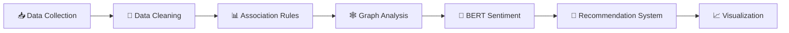

<div align="center">

# ✨ FOOD DELIVERY PATTERN ANALYSIS ✨


<br><br>


<br><br>


<br><br>


</div>

---

# 🌟 ABOUT THE PROJECT

This project focuses on analyzing customer food ordering behavior using advanced **Data Mining**, **Machine Learning**, and **Graph Analysis** techniques.

The project combines:

✨ Association Rule Mining  
✨ PageRank Graph Analysis  
✨ BERT Sentiment Analysis  
✨ Recommendation Systems  

to discover hidden ordering patterns and generate intelligent food recommendations.

The system simulates real-world food delivery platforms such as:

🍔 Uber Eats  
🍕 Talabat  
🌯 Deliveroo  

---

# 🎯 PROJECT GOALS

<div align="center">

| 🚀 Goal | 📌 Description |
|---|---|
| 🍟 Frequent Itemsets | Discover meals ordered together |
| 📊 Association Rules | Analyze customer ordering behavior |
| ⭐ PageRank Analysis | Rank popular meals |
| 🤖 BERT Sentiment Analysis | Analyze customer reviews |
| 🍔 Recommendation System | Generate smart meal suggestions |
| 📈 Data Visualization | Visualize patterns and insights |

</div>

---

# 🧠 TECHNIQUES & ALGORITHMS

---

## 🔹 Association Rule Mining

Association Rule Mining was applied to identify relationships between meals frequently ordered together.

### ✅ Algorithms Used
- Apriori Algorithm
- FP-Growth Algorithm

### 📌 Example Rules
✔ Burger ➜ Fries  
✔ Pizza ➜ Cola  
✔ Pasta ➜ Garlic Bread  
✔ Shawarma ➜ Pepsi  

### 🎯 Purpose
- Discover hidden customer patterns
- Generate meal recommendations
- Identify best-selling combinations

---

## 🔹 Graph Analysis using PageRank

A graph network was created where:

- Nodes → Meals
- Edges → Meal Relationships

The PageRank algorithm was used to rank the most influential meals.

### 🎯 Goals
✔ Detect highly connected meals  
✔ Analyze customer ordering behavior  
✔ Identify popular meals  

---

## 🔹 BERT Sentiment Analysis

BERT was used to classify customer reviews into:

😊 Positive  
😐 Neutral  
😡 Negative  

### 🎯 Goals
- Understand customer satisfaction
- Analyze customer feedback
- Improve recommendation quality

---

# ⚙️ TECHNOLOGIES USED

<div align="center">

| 🛠 Technology | 💡 Purpose |
|---|---|
| Python | Core Programming |
| Pandas | Data Processing |
| NumPy | Numerical Analysis |
| NetworkX | Graph Analysis |
| mlxtend | Association Rule Mining |
| Transformers (BERT) | NLP & Sentiment Analysis |
| Matplotlib | Visualization |
| Seaborn | Statistical Charts |
| Jupyter Notebook | Development Environment |

</div>

---

# 📂 PROJECT STRUCTURE

```bash
Project Final DM/
│
├── Project__Finall_Data_Mining_ipynb.ipynb
├── app.py
├── food_delivery_pattern_analysis_1000_rows.csv
├── frequent_itemsets.csv
├── best_meal_combinations.csv
├── meal_graph_analysis.csv
├── final_recommendations.csv
├── README.md
├── requirements.txt
└── .gitignore
```

---

# 📊 DATASET DESCRIPTION

The dataset contains:

🍔 Meal Names  
🍟 Meal Categories  
⭐ Customer Ratings  
📝 Customer Reviews  
🛒 Order Transactions  

Each transaction represents meals ordered together by customers.

The dataset was cleaned and processed before applying data mining algorithms.

---

# 🔄 PROJECT PIPELINE

<div align="center">



</div>

---

# 📈 DATA VISUALIZATION

The project generates several visualizations including:

📊 Frequent Itemsets Charts  
📈 Association Rules Graphs  
🕸 Meal Network Graphs  
😊 Sentiment Distribution Charts  
⭐ Meal Ranking Visualizations  

---

# 📌 KEY INSIGHTS

✅ Customers frequently order fast-food combinations together  
✅ Positive reviews increase meal popularity  
✅ Certain meals dominate the ordering network  
✅ Recommendation systems improve customer experience  
✅ Graph analysis identifies influential menu items  

---

# 🤖 RECOMMENDATION SYSTEM

The recommendation system suggests meals based on:

✔ Frequent itemsets  
✔ Popular meal rankings  
✔ Customer behavior  
✔ Graph relationships  

The system helps improve customer engagement and recommendation accuracy.

---

# 🚀 HOW TO RUN THE PROJECT

## 1️⃣ Clone Repository

```bash
git clone https://github.com/your-username/Food-Delivery-Pattern-Analysis.git
```

---

## 2️⃣ Install Required Libraries

```bash
pip install -r requirements.txt
```

---

## 3️⃣ Open Jupyter Notebook

```bash
jupyter notebook
```

Open:

```bash
Project__Finall_Data_Mining_ipynb.ipynb
```

---

# 📄 FILES DESCRIPTION

| 📂 File | 📌 Description |
|---|---|
| Project__Finall_Data_Mining_ipynb.ipynb | Main Notebook |
| app.py | Main Application |
| food_delivery_pattern_analysis_1000_rows.csv | Main Dataset |
| frequent_itemsets.csv | Frequent Itemsets |
| best_meal_combinations.csv | Best Meal Combinations |
| meal_graph_analysis.csv | Graph Analysis Results |
| final_recommendations.csv | Final Recommendations |

---

# 🏆 PROJECT RESULTS

<div align="center">

| ✅ Achievement | 🚀 Status |
|---|---|
| Frequent Pattern Mining | ✅ Completed |
| PageRank Analysis | ✅ Completed |
| BERT Sentiment Analysis | ✅ Completed |
| Recommendation System | ✅ Completed |
| Data Visualization | ✅ Completed |

</div>

---

# 🔮 FUTURE IMPROVEMENTS

✨ Real-time recommendation systems  
✨ Web application deployment  
✨ Live API integration  
✨ Personalized recommendations  
✨ Advanced deep learning models  

---

# 👨‍💻 TEAM MEMBERS

<div align="center">

| 🌟 Name | 💼 Role |
|---|---|
| Yasmin Ramadan | Team Leader |
| Omnia Ayman | Team Member |
| Ibrahim Galal | Team Member |
| Youssef Saeed | Team Member |
| Mazen Reda | Team Member |

</div>

---

# 🏁 CONCLUSION

This project demonstrates how:

✨ Data Mining  
✨ Graph Analysis  
✨ Deep Learning  
✨ Recommendation Systems  

can work together to generate meaningful insights from food delivery platforms and improve customer experience.

The integration of:
- Association Rule Mining
- PageRank
- BERT Sentiment Analysis

allowed the system to generate intelligent recommendations and valuable business insights.

---

<div align="center">


<br><br>


</div>
