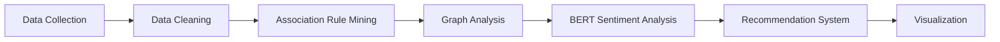

<div align="center">


<br>

<h1 align="center">Food Delivery Pattern Analysis & BERT-Based Recommendation System</h1>

<p align="center">
Association Rule Mining • PageRank Analysis • Graph Mining • BERT Sentiment Analysis
</p>

<br>


<br><br>


<br><br>


</div>

---

# 📌 PROJECT OVERVIEW

This project analyzes customer food ordering behavior using advanced **Data Mining**, **Machine Learning**, and **Graph Analysis** techniques.

The project combines multiple intelligent systems including:

- Association Rule Mining
- Graph-Based Link Analysis
- PageRank Algorithm
- BERT Sentiment Analysis
- Recommendation Systems

The main objective is to extract meaningful insights from food delivery data and customer reviews in order to improve customer experience and generate smart food recommendations.

The project simulates real-world food delivery platforms such as:

- Uber Eats
- Talabat
- Deliveroo

---

# 🎯 PROJECT OBJECTIVES

<div align="center">

| Objective | Description |
|---|---|
| Frequent Itemsets | Discover meals ordered together |
| Association Rules | Analyze ordering behavior |
| PageRank Analysis | Rank the most popular meals |
| BERT Sentiment Analysis | Analyze customer reviews |
| Recommendation System | Generate smart meal recommendations |
| Data Visualization | Create visual insights and graphs |

</div>

---

# 🧠 ALGORITHMS & TECHNIQUES

## 🔹 Association Rule Mining

Association Rule Mining was used to identify relationships between meals frequently ordered together.

### Algorithms Used:
- Apriori Algorithm
- FP-Growth Algorithm

### Example Rules:
- Burger ➜ Fries
- Pizza ➜ Cola
- Pasta ➜ Garlic Bread
- Shawarma ➜ Pepsi

### Purpose:
- Discover hidden customer behavior patterns
- Generate intelligent recommendations
- Analyze customer preferences

---

## 🔹 Graph Analysis using PageRank

A graph network was constructed where:

- Nodes represent meals
- Edges represent meals ordered together

The PageRank algorithm was applied to identify the most influential meals in the network.

### Goals:
- Detect highly connected meals
- Analyze ordering relationships
- Rank meal popularity

---

## 🔹 BERT Sentiment Analysis

BERT was used to classify customer reviews into:

- Positive
- Neutral
- Negative

### Goals:
- Understand customer satisfaction
- Analyze customer feedback
- Improve recommendation quality

---

# ⚙️ TECHNOLOGIES USED

<div align="center">

| Technology | Purpose |
|---|---|
| Python | Core Programming |
| Pandas | Data Analysis |
| NumPy | Numerical Computing |
| NetworkX | Graph Analysis |
| mlxtend | Association Rule Mining |
| Transformers (BERT) | NLP & Sentiment Analysis |
| Matplotlib | Visualization |
| Seaborn | Statistical Visualization |
| Jupyter Notebook | Development Environment |

</div>

---

# 📂 PROJECT STRUCTURE

```bash
Project Final DM/
│
├── Project__Finall_Data_Mining_ipynb.ipynb
├── app.py
├── food_delivery_pattern_analysis_1000_rows.csv
├── frequent_itemsets.csv
├── best_meal_combinations.csv
├── meal_graph_analysis.csv
├── final_recommendations.csv
├── README.md
├── requirements.txt
└── .gitignore
```

---

# 📊 DATASET DESCRIPTION

The dataset contains information related to customer orders and food delivery transactions.

### Dataset Includes:
- Meal Names
- Meal Categories
- Customer Ratings
- Customer Reviews
- Transaction Data
- Meal Combinations

Each transaction represents meals ordered together by customers.

The dataset was cleaned and processed before applying machine learning and data mining techniques.

---

# 🔄 PROJECT PIPELINE

<div align="center">



</div>

---

# 📈 DATA VISUALIZATION

The project generates multiple visualizations including:

- Frequent Itemsets Charts
- Association Rules Graphs
- Meal Network Graphs
- Sentiment Distribution Charts
- Meal Ranking Visualizations

Visualization libraries used:
- Matplotlib
- Seaborn
- NetworkX

---

# 📌 KEY INSIGHTS

- Customers frequently order fast-food combinations together
- Positive reviews significantly impact meal popularity
- Some meals dominate the ordering network
- Recommendation systems improve customer engagement
- Graph analysis identifies influential menu items

---

# 🤖 RECOMMENDATION SYSTEM

The recommendation system suggests meals based on:

- Frequent itemsets
- Popular meal rankings
- Customer behavior patterns
- Graph relationships

The system improves recommendation accuracy and customer experience.

---

# 🚀 HOW TO RUN THE PROJECT

## 1️⃣ Clone Repository

```bash
git clone https://github.com/your-username/Food-Delivery-Pattern-Analysis.git
```

---

## 2️⃣ Install Required Libraries

```bash
pip install -r requirements.txt
```

---

## 3️⃣ Open Jupyter Notebook

```bash
jupyter notebook
```

Open:

```bash
Project__Finall_Data_Mining_ipynb.ipynb
```

---

# 📄 FILES DESCRIPTION

| File | Description |
|---|---|
| Project__Finall_Data_Mining_ipynb.ipynb | Main Notebook |
| app.py | Main Application |
| food_delivery_pattern_analysis_1000_rows.csv | Main Dataset |
| frequent_itemsets.csv | Frequent Itemsets Results |
| best_meal_combinations.csv | Best Meal Recommendations |
| meal_graph_analysis.csv | Graph Analysis Results |
| final_recommendations.csv | Final Recommendation Output |

---

# 🏆 PROJECT RESULTS

<div align="center">

| Achievement | Status |
|---|---|
| Frequent Pattern Mining | Completed |
| PageRank Analysis | Completed |
| BERT Sentiment Analysis | Completed |
| Recommendation System | Completed |
| Data Visualization | Completed |

</div>

---

# 🔮 FUTURE IMPROVEMENTS

- Real-time recommendation systems
- Web application deployment
- Live API integration
- Personalized recommendations
- Advanced deep learning models

---

# 👨‍💻 TEAM MEMBERS

<div align="center">

| Name | Role |
|---|---|
| Yasmin Ramadan | Team Leader |
| Omnia Ayman | Team Member |
| Ibrahim Galal | Team Member |
| Youssef Saeed | Team Member |
| Mazen Reda | Team Member |

</div>

---

# 🏁 CONCLUSION

This project demonstrates how:

- Data Mining
- Graph Analysis
- Deep Learning
- Recommendation Systems

can work together to generate meaningful insights from food delivery platforms and improve customer experience.

The integration of:
- Association Rule Mining
- PageRank
- BERT Sentiment Analysis

allowed the project to generate intelligent recommendations and valuable business insights.

---

<div align="center">

<h3>Thanks For Visiting Our Project</h3>


</div>
