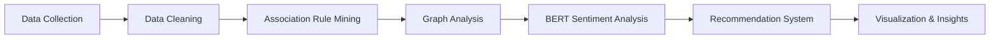

<div align="center">

# 🍔 Food Delivery Pattern Analysis 🍟


---


---


# 🌟 Project Overview

This project focuses on analyzing customer food ordering behavior using advanced:

✨ Data Mining Techniques  
✨ Graph Analysis  
✨ Deep Learning Models  
✨ Recommendation Systems  

The project simulates real-world food delivery platforms such as:

🍕 Talabat  
🍔 Uber Eats  
🥙 Deliveroo  

The main objective is to discover hidden ordering patterns, analyze customer reviews, and generate intelligent meal recommendations.

---

# 🎯 Main Objectives

<div align="center">

| Objective | Description |
|---|---|
| 🍟 Frequent Itemsets | Discover meals frequently ordered together |
| 📊 Association Rules | Analyze customer ordering patterns |
| ⭐ PageRank Analysis | Rank the most popular meals |
| 🤖 BERT Sentiment Analysis | Analyze customer reviews |
| 🍔 Recommendation System | Suggest meal combinations |
| 📈 Visualization | Generate insights using charts and graphs |

</div>

---

# 🧠 Algorithms & Techniques

## 🔹 Association Rule Mining
Used to discover relationships between meals frequently ordered together.

### Algorithms Used:
- Apriori Algorithm
- FP-Growth Algorithm

### Example Rules:
✅ Burger ➜ Fries  
✅ Pizza ➜ Cola  
✅ Shawarma ➜ Pepsi  
✅ Pasta ➜ Garlic Bread  

---

## 🔹 Graph Analysis using PageRank

A graph network was created where:

- Nodes → Meals
- Edges → Meal Relationships

### Purpose:
✔ Rank important meals  
✔ Discover highly connected meals  
✔ Analyze customer behavior patterns  

---

## 🔹 BERT Sentiment Analysis

BERT was applied to analyze customer reviews and classify sentiments into:

😊 Positive  
😐 Neutral  
😡 Negative  

### Purpose:
- Analyze customer satisfaction
- Understand review sentiment
- Improve recommendation quality

---

# 🚀 Technologies Used

<div align="center">

| Technology | Purpose |
|---|---|
| Python | Programming Language |
| Pandas | Data Analysis |
| NumPy | Numerical Computing |
| NetworkX | Graph Analysis |
| mlxtend | Association Rule Mining |
| Transformers (BERT) | NLP & Sentiment Analysis |
| Matplotlib | Data Visualization |
| Seaborn | Statistical Visualization |
| Jupyter Notebook | Development Environment |

</div>

---

# 📂 Project Structure

```bash
Project Final DM/
│
├── Project__Finall_Data_Mining_ipynb.ipynb
├── app.py
├── food_delivery_pattern_analysis_1000_rows.csv
├── frequent_itemsets.csv
├── best_meal_combinations.csv
├── meal_graph_analysis.csv
├── final_recommendations.csv
├── README.md
├── requirements.txt
└── .gitignore
```

---

# 📊 Dataset Description

The dataset contains:

🍔 Meal Names  
🍟 Meal Categories  
⭐ Customer Ratings  
📝 Customer Reviews  
🛒 Order Transactions  

Each transaction represents meals ordered together by customers.

The dataset was cleaned and processed before applying data mining techniques.

---

# 🔄 Project Workflow

<div align="center">



</div>

---

# 📈 Data Visualization

The project generates multiple visualizations including:

📊 Frequent Itemsets Charts  
📈 Association Rules Graphs  
🕸 Meal Network Graphs  
😊 Sentiment Distribution Charts  
⭐ Meal Ranking Visualizations  

---

# 📌 Key Insights

✅ Customers frequently order fast-food combinations together  
✅ Positive reviews increase meal popularity  
✅ Some meals dominate the ordering network  
✅ Recommendation systems improve customer experience  

---

# 🤖 Recommendation System

The recommendation system suggests meals based on:

✔ Frequently ordered combinations  
✔ Popular meal rankings  
✔ Customer ordering behavior  
✔ Graph relationships  

---

# 🚀 How To Run The Project

## 1️⃣ Clone Repository

```bash
git clone https://github.com/your-username/Food-Delivery-Pattern-Analysis.git
```

---

## 2️⃣ Install Required Libraries

```bash
pip install -r requirements.txt
```

---

## 3️⃣ Open Jupyter Notebook

```bash
jupyter notebook
```

Open:

```bash
Project__Finall_Data_Mining_ipynb.ipynb
```

---

# 📄 Files Description

| File | Description |
|---|---|
| Project__Finall_Data_Mining_ipynb.ipynb | Main Notebook |
| app.py | Main Application |
| food_delivery_pattern_analysis_1000_rows.csv | Main Dataset |
| frequent_itemsets.csv | Frequent Itemsets |
| best_meal_combinations.csv | Best Meal Combinations |
| meal_graph_analysis.csv | Graph Analysis Results |
| final_recommendations.csv | Final Recommendations |

---

# 🔮 Future Improvements

✨ Real-time recommendation systems  
✨ Web application deployment  
✨ Live API integration  
✨ Advanced deep learning recommendation models  
✨ Personalized customer recommendations  

---

# 👨‍💻 Team Members

<div align="center">

| Name | Role |
|---|---|
| 🌟 Yasmin Ramadan | Team Leader |
| 💻 Omnia Ayman | Team Member |
| 📊 Ibrahim Galal | Team Member |
| 🤖 Youssef Saeed | Team Member |
| 🚀 Mazen Reda | Team Member |

</div>

---

# 🏆 Project Results

<div align="center">

| Achievement | Status |
|---|---|
| Frequent Pattern Mining | ✅ Completed |
| PageRank Analysis | ✅ Completed |
| BERT Sentiment Analysis | ✅ Completed |
| Recommendation System | ✅ Completed |
| Data Visualization | ✅ Completed |

</div>

---

# 🏁 Conclusion

This project demonstrates how:

✨ Data Mining  
✨ Graph Analysis  
✨ Deep Learning  
✨ Recommendation Systems  

can work together to generate meaningful insights from food delivery platforms and improve customer experience.

---

### 💖 Don't Forget To Star The Repository 💖
